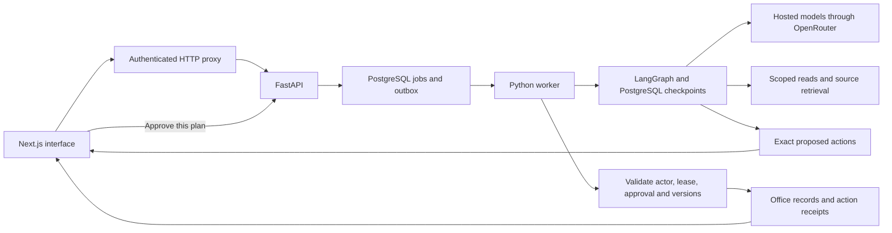

# Practice Assistant: system design

Practice Assistant turns a physician's office request into an inspectable plan, then carries out the approved changes against persistent demonstration services. The three connected workflows are preparation for tomorrow, public content and review, and engineering coordination. The fictional records make the workflows repeatable without private practice access. Public research supplies attributed context; it does not grant access to EmerGPT or any employer system.

## Request and execution path

The API accepts an authenticated request and saves a job. A persistent worker claims it with a time-limited lease and generation number. The model chooses tools, reads current records, retrieves sources and proposes actions. LangGraph checkpoints retain the conversation and tool state between steps. An approval pauses the workflow while releasing the worker. The browser later approves a specific saved plan; it cannot authorize arbitrary replacement arguments.

The executor checks the approved payload, role, expiry, record versions and current worker lease inside the database transaction that writes each effect. A stale plan returns to the assistant for a fresh read and proposal. Existing approval never authorizes that replacement. After each action, the stored record is read back and the visible run records its receipt.

## Components and responsibilities

| Component | Responsibility |
|---|---|
| Next.js, React and TypeScript | Workspace dashboard, conversation, action review, preferences, scenario controls and run evidence |
| FastAPI and Pydantic | Authenticated HTTP boundary, validated inputs, snapshots, approval, voice and evidence endpoints |
| PostgreSQL and psycopg | Authoritative records, exact plans, receipts, role-scoped reads, jobs, leases and event deduplication |
| Supabase | Anonymous demonstration identity, isolated database, private evidence storage and owner-only Realtime revision notifications |
| LangGraph with PostgreSQL checkpoints | Persisted model/tool state and continuation after approval or worker interruption |
| OpenRouter | Hosted routing, planning, public drafting, embeddings, speech recognition and speech synthesis |
| pgvector and PostgreSQL text search | Role-filtered retrieval with 1,536-dimensional embeddings and combined lexical/vector ranking |
| MCP stdio adapter | External tool access through the same authenticated HTTP API |
| OpenTelemetry | Actual model spans; bounded local span history and optional OTLP export |

The release configuration places the web interface on Vercel and the API and persistent worker on Render. Deployment verification is reported separately; a healthy API alone does not prove a working worker. The implementation has no AWS dependency.

## Ownership and information boundaries

Each visitor receives a Supabase identity and owns an independent fictional workspace. Switching roles demonstrates permissions inside that visitor's workspace; it is not a substitute for staff identity administration. The API verifies ownership before applying the selected role. Database office tables deny direct browser access. Only the workspace's owner can read its revision notifications through Realtime.

The doctor can see the complete fictional office. The coordinator can see administrative work but not private preferences or engineering records. The content editor receives content, its review tasks, recording holds and public sources. Available recording windows are calculated from the full calendar and exposed only as start/end times, without private appointment names or IDs. Scope restrictions apply before source ranking and before evidence export.

For the public drafting specialist, the caller supplies public source IDs and bounded choices for format and angle. The server constructs the prompt from approved public fields and fixed writing instructions. An arbitrary brief, private metadata and free-form preference text cannot enter this specialist path. Its response must be a valid object with bounded title, script, caption and citations drawn from the selected sources. The parser supports ordinary JSON and an exact JSON code fence, and rejects duplicate keys, invalid types and unknown source citations. Content-route action proposals are also validated with editor permissions even when the person approving is the doctor.

The general doctor planner necessarily sees the doctor's scoped office data. This demonstration does not claim formal information-flow guarantees for unrestricted mixed requests or certify model-generated content as clinically appropriate.

## Records, memory and retrieval

Office records have a workspace, stable ID, kind, structured data and incrementing version. Calendar events, administrative preparation, messages, tasks, content and engineering updates share this record layer. Structured confirmed preferences have their own ownership, scope and version; users can edit or delete them. This is persistent preference memory plus saved run history, not an unlimited semantic archive of every conversation.

The source collection contains five short public research notes and one fictional scheduling note. Sources retain attribution, provenance and versions. Changed source text or embedding model invalidates its embedding cache. Candidate source IDs are restricted by role before either retrieval ranker runs. Text ranking and cosine similarity contribute to a combined ranking; the answer receives source IDs and URLs for attribution.

The paperwork calculation uses the public administrative policy's 24-hour rule and timezone-aware appointment arithmetic. The fictional clock is September 8, 2026, 08:15 Pacific. A September 9, 09:00 appointment therefore has a paperwork deadline 45 minutes after that clock. This calculation says nothing about clinical readiness.

Checking a source URL verifies the exact allowlisted URL's reachability and a bounded content fingerprint. Redirects and caller-supplied URL overrides are rejected. The check does not silently replace the reviewed source note or certify current prices, policies or claims.

## Approval and failure semantics

- A plan binds immutable actions to an owner, role and versioned evidence. It expires after 30 minutes. Approval is required before the first effect.
- Calendar checks protect patient appointments, office hours, the 30 minutes before the first patient, occupied slots and the internal meeting's structured attendee availability. Changes to the calendar or supporting records invalidate outstanding proposals.
- Each action's mutation and receipt commit in one transaction. A stable action ID makes a repeated execution return the prior receipt. Multiple actions are not one global transaction: completed effects remain visible if a later action fails.
- The workspace lock and worker generation check fence effects from cancelled, reset or superseded workers. An expired worker cannot write after a replacement claims its job.
- A lost response after commit is reconciled from the saved receipt. The physical crash check kills an executor at this point, waits for the actual lease expiry and resumes from another process without duplicate effects.
- Versioned handoff events name a target record. Paperwork completion updates only that administrative record and permitted linked tasks; content review updates only that draft and linked review tasks. Repeated event IDs with changed payloads are rejected. Target-state idempotence also prevents repeated completion under a new ID.
- The event outbox uses separate short leases and generation checks inside the effect transaction. A workspace reset removes prior event ownership, preventing old events from mutating newly seeded records.

## Models and measured operation

The default routes use Gemini for classification, an OpenAI model for planning, Claude for public drafting, and OpenAI embeddings. These are configurable hosted routes through one gateway; provider diversity does not establish gateway outage resilience. Costs and token counts are retained when providers return them, with explicit unknowns when they do not. Run limits bound work; the small routing evaluation is an example comparison, not a broad model benchmark.

Voice uses dedicated hosted endpoints: `openai/whisper-large-v3-turbo` for transcription and `hexgrad/kokoro-82m` with the preset `af_heart` voice for speech. This replaced a chat-audio model whose available endpoint was incompatible with the existing account's data policy. The account settings were preserved. Speech returns raw MP3 bytes and a generation ID; the application does not invent a token count or charge for that response. See the [OpenRouter speech recognition](https://openrouter.ai/docs/guides/overview/multimodal/stt), [speech synthesis](https://openrouter.ai/docs/guides/overview/multimodal/tts) and [Kokoro voice](https://huggingface.co/hexgrad/Kokoro-82M/blob/main/VOICES.md) documentation.

Run evidence includes model names, public tool arguments/results, durations, usage, approvals and stored receipts. It excludes provider hidden reasoning fields. Evidence exports require the same workspace and role as the run and use private, workspace-scoped objects with ten-minute signed links. The signed response is checked against the exact requested object path before it is returned.

## Scope of the demonstration

All office writes are real PostgreSQL effects in the demonstration's own services. Messages go to its demonstration inbox. There is no live email delivery, calendar vendor connection, CRM/EMR connection, employer authentication or medical decision system. A practice deployment would require approved vendor connectors and contracts, real staff permissions, workflow validation, operational ownership and a separate compliance assessment. The current deliverable demonstrates the architecture, tools, recovery behavior and user flows without claiming those integrations exist.
